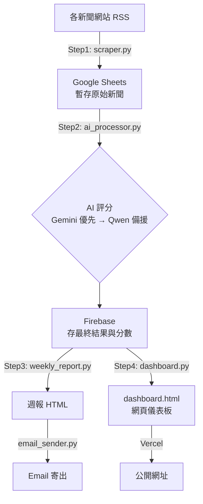

# 新創投資情報系統（STARTUP-CLAW）操作手冊

給非技術人員看的說明書：這個系統在做什麼、每週怎麼跑、還有「我想改一個東西，要去哪裡改」。

---

## 1. 這是什麼

一個全自動的機器人，**每週五早上 9 點（台灣時間）自己跑一次**，做四件事：

1. 到全球各家新聞網站（台灣、中國、東南亞、國際）抓「新創公司拿到融資」的新聞
2. 用 AI（Gemini / Qwen）幫每一則新聞打分數：這家新創跟和泰集團的 13 大業務有多相關、值得投資的程度多高
3. 把結果存進資料庫（Firebase），並產生一份週報
4. 把週報寄到指定信箱、同時更新一個網頁版儀表板

不需要人手動點開始——它會自己跑。人要做的事，通常只是「看週報」跟「偶爾調整參數」。

---

## 2. 整體架構



**白話版流程：**

| 步驟 | 檔案 | 在做什麼 |
|---|---|---|
| Step 1 | `scraper.py` | 抓新聞，存到 Google Sheets（當週一個分頁，例如 `raw_2026-07-17`） |
| Step 2 | `ai_processor.py` | 讀 Sheets → 送給 AI 判斷「是不是新創融資新聞」「跟和泰哪個業務相關」→ 打分數 → 寫進 Firebase |
| Step 3 | `weekly_report.py` + `email_sender.py` | 把 Firebase 的資料整理成一份週報，寄信 |
| Step 4 | `dashboard.py` | 產生網頁儀表板（`dashboard.html`），給大家隨時上網看歷史資料 |

---

## 3. 自動排程 — 不用手動開

排程設定在 `.github/workflows/daily_run.yml`：

- **每週五 UTC 01:00（= 台灣時間 09:00）** 自動觸發，跑完整流程（抓新聞 → AI 評分 → 寄週報 → 更新儀表板）
- 也可以到 GitHub 的 Actions 頁面手動點 **"Run workflow"** 立即觸發一次
- 跑完後會自動把新的 `dashboard.html` 和 `weekly_report_*.html` commit 回這個 repo

這台 Codespace（你現在在用的這個開發環境）**不是**排程實際執行的地方，只是給人手動測試、除錯用的。真正每週自動執行是在 GitHub Actions 的雲端機器上，那邊沒有 Ollama，所以全部改用 Cerebras/Gemini（見下方 FAQ）。

---

## 4. ⭐ 我想改參數，要去哪裡改

**幾乎所有「業務邏輯」相關的參數都集中在 `config.py` 這一個檔案**，改這個檔案不需要動其他程式碼。

| 我想改... | 去哪個檔案 | 改什麼變數 |
|---|---|---|
| **和泰集團關鍵字**（判斷新聞跟哪個業務相關） | `config.py` | `FIT_KEYWORDS`（13 大業務版圖分類，每類一組關鍵字）、`CORE_BUSINESS_HITS`（命中會額外加分的核心業務詞） |
| **要爬哪些新聞網站 / RSS** | `config.py` | `SOURCES`（每個來源一筆：id、名稱、RSS 網址、地區、是否啟用 `enabled`、是否要求標題含融資字眼 `require_funding`） |
| **AI 評分的門檻/權重** | `config.py` | `HOTAI_MIN_FIT_SCORE`（低於此分數不寫入 Firebase）、`GROUP_FIT_WEIGHT_*` / `STARTUP_SCORE_WEIGHT_*`（AI分數 vs 關鍵字 vs 業務規則各佔多少權重）、`FUNDING_SCORE_TIERS`（融資金額對應分數級距）、`STAGE_MATURITY_SCORE`（輪次對應成熟度分數） |
| **哪些新聞直接跳過、不送 AI 判斷** | `config.py` | `RULE_SKIP_TITLE`（標題含這些字直接略過，例如股市、總經新聞）、`SKIP_KEYWORDS` |
| **哪些關鍵字代表「這是一則新創新聞」** | `config.py` | `FUNDING_TITLE_KEYWORDS`、`STRONG_FUNDING_KW`、`STRONG_STARTUP_KW` |
| **產業分類清單**（AI/SaaS/FinTech...） | `config.py` | `VALID_INDUSTRIES`、`INDUSTRY_ALIAS`（AI 常打錯字的產業名稱要對應回標準分類） |
| **偏好的融資輪次 / 地區加分** | `config.py` | `PREFERRED_STAGES`、`PREFERRED_REGIONS`、`REGION_BONUS_*`、`STAGE_BONUS_*` |
| **AI 模型**（要用哪個 Cerebras/Qwen 版本、Gemini 版本） | `config.py` | `CEREBRAS_MODEL`、`OLLAMA_MODEL`（本機備援模型）、`GEMINI_ENDPOINT`（網址裡的模型名稱） |
| **LLM 呼叫順序**（目前是 Cerebras → Gemini → Qwen） | `ai_processor.py` 的 `call_llm_with_retry()` | 前面的服務沒設定 API key 或額度用完，才會往後 fallback；想改順序要動這段程式碼 |
| **每次最多處理幾篇文章（避免跑太久/太貴）** | `config.py` | `MAX_ARTICLES_PER_SOURCE`、`MAX_GEMINI_PER_RUN`、`REGION_WEEKLY_CAP` |
| **週報收件人** | `.env` | `REPORT_RECIPIENTS`（逗號分隔多個 email） |
| **週報顯示樣式**（每區顯示幾則、排列順序、顏色） | `config.py` | `REGION_ORDER`、`REGION_DISPLAY_MAX` / `REGION_DISPLAY_MIN`、`INDUSTRY_COLOR`、`MIN_DISPLAY_GROUP_FIT` |
| **自動執行時間** | `.github/workflows/daily_run.yml` | `cron: "0 1 * * 5"`（分 時 日 月 星期，UTC 時區） |

> 改完 `config.py` 裡的關鍵字或權重後，**不用重新部署**，下次排程自動跑就會套用新設定。

---

## 5. `.env` 需要哪些變數

`.env` 放在 repo 根目錄，內容是機密資訊，**不會**被 commit 到 git（已被 `.gitignore` 排除）。範本在 `.env.example`。

| 變數 | 必填？ | 用途 |
|---|---|---|
| `GOOGLE_CREDENTIALS_JSON` | ✅ 必填 | Google 服務帳號金鑰（整包 JSON），同時用來讀寫 Google Sheets 和 Firebase |
| `FIREBASE_PROJECT_ID` | ✅ 必填 | Firebase 專案 ID |
| `SHEETS_ID` | ✅ 必填 | Google Sheet 的 ID（暫存新聞用） |
| `CEREBRAS_API_KEY` | 選填 | 有填才會啟用 Cerebras（第一優先，速度最快）；沒填就跳過，改試 Gemini |
| `GEMINI_API_KEY` | 選填 | 有填才會啟用 Gemini（第二優先）；沒填就整個流程只用本機 Qwen |
| `EMAIL_SENDER` / `EMAIL_PASSWORD` | 選填 | 寄週報用的 Gmail 帳號 + App Password；沒填的話週報只會存成本機 HTML 檔，不會寄信 |
| `REPORT_RECIPIENTS` | 選填 | 週報收件人，逗號分隔 |

GitHub Actions 排程執行時，這些變數是設定在 **repo 的 Secrets**（Settings → Secrets and variables → Actions），跟這裡的 `.env` 是分開兩份，要同步更新才會兩邊都生效。

---

## 6. 手動測試指令

在 Codespace 終端機裡可以單獨跑某一個步驟，方便測試：

```bash
python main.py --step1              # 只抓新聞
python main.py --step2              # 只跑 AI 評分（讀最新一週的 Sheet 分頁）
python main.py --step3              # 只產生週報（存成本機 HTML，不寄信）
python main.py --step3 --email      # 產生週報並寄信
python main.py --step4              # 只重新產生 dashboard.html
python main.py --email              # 整個流程都跑一次，並寄信
```

---

## 7. 常見問題

**Q：Ollama 沒開，會怎樣？**
`main.py` 每次執行都會自動偵測並嘗試啟動 `ollama serve`；真的沒裝的環境（例如 GitHub Actions 雲端機器）會自動改成「只用 Cerebras/Gemini」，不會讓整個流程失敗。

**Q：Cerebras 或 Gemini 額度用完了怎麼辦？**
系統會自動偵測 429（額度用完）錯誤並依序往下 fallback：Cerebras 額度用完 → 切 Gemini；Gemini 也用完 → 切 Qwen。如果該次執行環境沒有 Qwen（例如雲端），`main.py` 會等幾分鐘後用全新流程重試（額度通常幾分鐘內恢復），最多重試 6 次；如果重試後仍有文章因為額度問題被跳過，log 會明確列出「N 篇文章因故被跳過」，不會悄悄當作全部處理完成。

**Q：週報沒收到信？**
檢查 `.env`（或 GitHub Secrets）裡的 `EMAIL_SENDER` / `EMAIL_PASSWORD` / `REPORT_RECIPIENTS` 是否有填；沒填的話系統只會把週報存成本機 HTML 檔，不會報錯，但也不會寄信。

**Q：想新增一個新聞來源怎麼辦？**
在 `config.py` 的 `SOURCES` 清單裡照既有格式加一筆（id、name、rss 網址、region、enabled），存檔即可，下次執行就會抓這個來源。

**Q：想新增一個和泰業務分類（例如新事業）？**
在 `config.py` 的 `FIT_KEYWORDS` 裡新增一組分類與關鍵字，同時要在 `TAG_LABELS` 補上對應的中文顯示名稱（程式有 assert 檢查兩者要一致，忘記補會直接報錯提醒）。
